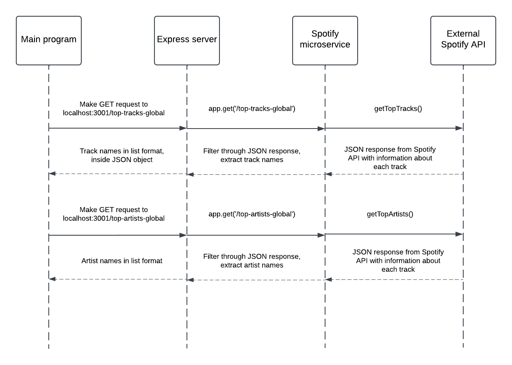

## How to programmatically request data from the microservice

Send a GET request to the REST endpoint you are trying to reach. There are two in this microservice, localhost:3001/top-tracks-global and
localhost:3001/top-artists-global. In your main project, you will need a module that sends requests. For example, in Python you might use the
following example call: 
```
import requests
tracks_url = 'http://localhost:3001/top-tracks-global'
tracks_response = requests.get(url)
artists_url = 'http://localhost:3001/top-artists-global'
artists_response = requests.get(url)
```

## How to programmatically receive data from the microservice

Upon sending the GET request to the endpoint, the microservice will return the requested data in JSON format. To receive the data, simply parse the JSON
object received. Continuing the example above, in Python you could use the following to receive and parse the data for the top tracks (the same process
would be followed for top artists as well):
```
if tracks_response.status_code == 200:
    print("Track response data:")
    print(tracks_response.json())
```

## UML Sequence Diagram

